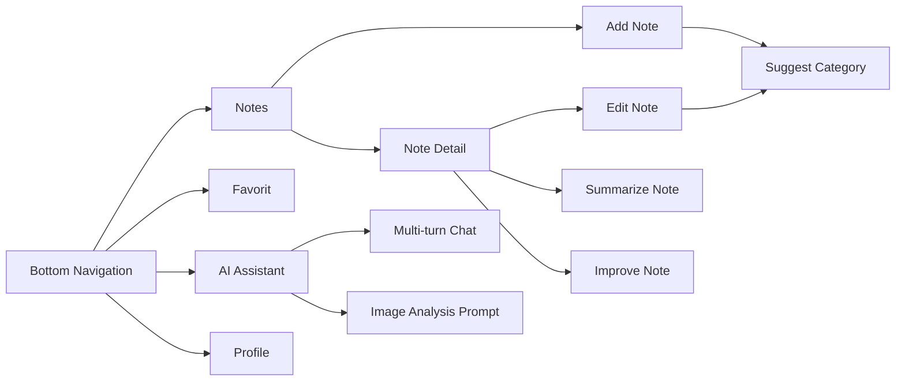
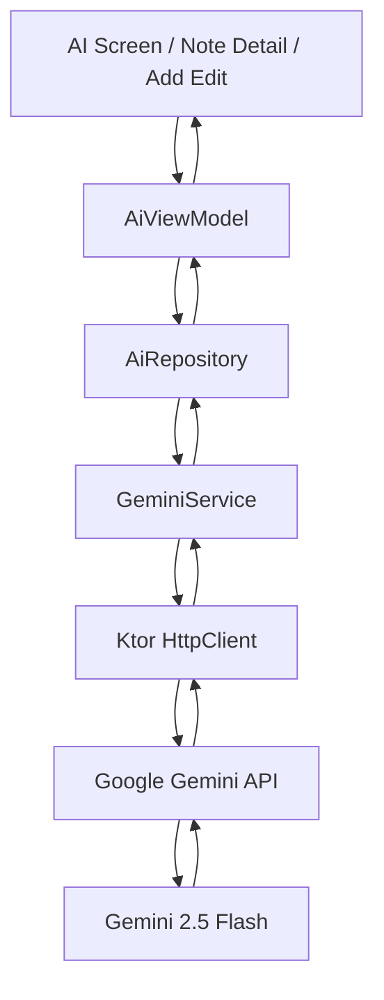

# 🤖 Tugas 9 - Smart Notes App with AI Assistant

<p align="center">
  
  
  
  
</p>

## 👤 Informasi Mahasiswa

| Data Diri | Keterangan |
| :--- | :--- |
| **Nama** | Awi Septian Prasetyo |
| **NIM** | 123140201 |
| **Mata Kuliah** | Pengembangan Aplikasi Mobile (PAM) |
| **Program Studi** | Teknik Informatika |
| **Institusi** | Institut Teknologi Sumatera (ITERA) |

---

## 📖 Deskripsi Proyek

Project ini merupakan evolusi dari **Tugas 8 - Platform Specific Features** menjadi **Tugas 9 - Integrasi AI API**. Aplikasi tetap mempertahankan konsep utama sebagai **Notes App**, tetapi sekarang ditingkatkan menjadi **Smart Notes App with AI Assistant**.

Aplikasi tetap memiliki fitur local database, favorite notes, settings, platform dashboard, dan offline-first dari tugas sebelumnya. Pada Tugas 9, aplikasi ditambahkan integrasi **Google Gemini API** untuk fitur AI seperti chat assistant, note summarization, improve note, suggest category, dan image analysis prompt mode.

Bottom navigation aplikasi:

```text
Notes | Favorit | AI | Profile
```

---

## 🎯 Fitur Tugas 9

### ✅ Fitur AI Utama

* **AI Assistant**  
  Halaman chat AI untuk membantu user membuat ide, bertanya, merangkum, dan mengorganisasi catatan.

* **Gemini API Integration**  
  Menggunakan Google Gemini API dengan model `gemini-2.5-flash`.

* **Multi-turn Conversation**  
  Chat menyimpan history percakapan agar AI dapat memahami konteks pesan sebelumnya.

* **Summarize Note**  
  AI dapat merangkum isi note dari halaman detail catatan.

* **Improve Note**  
  AI dapat membantu merapikan dan memperbaiki isi catatan agar lebih mudah dibaca.

* **Suggest Category**  
  AI dapat menyarankan kategori note berdasarkan title dan content di halaman Add/Edit Note.

* **Image Analysis Prompt Mode**  
  User dapat memasukkan deskripsi atau URL gambar untuk dianalisis AI sebagai catatan.

* **Streaming-like Response**  
  Response AI ditampilkan bertahap dengan efek typing/streaming-like untuk pengalaman UI yang lebih interaktif.

* **Prompt Engineering**  
  Prompt dipisahkan dalam `SystemPrompts` agar AI menjawab sesuai konteks aplikasi notes, menggunakan Bahasa Indonesia, dan output lebih terstruktur.

* **Error Handling**  
  Menangani API key kosong, unauthorized, rate limit, server error, network error, dan response kosong.

---

## 🧠 AI Features Detail

| Fitur | Lokasi | Fungsi |
| :--- | :--- | :--- |
| AI Assistant | Tab AI | Chat dengan Gemini untuk membantu catatan. |
| Multi-turn Chat | Tab AI | Percakapan menyimpan konteks sebelumnya. |
| Summarize Note | Note Detail | Merangkum isi catatan. |
| Improve Note | Note Detail | Merapikan catatan menjadi lebih terstruktur. |
| Suggest Category | Add/Edit Note | Memberikan rekomendasi kategori note. |
| Image Analysis Prompt | Tab AI | Analisis gambar berdasarkan deskripsi atau URL. |
| Streaming-like Response | Tab AI | Menampilkan jawaban AI bertahap seperti typing. |

---

## 🔐 Setup Gemini API Key

Project membaca API key dari file `local.properties`. File ini **tidak boleh di-commit ke GitHub**.

1. Buka Google AI Studio: `https://aistudio.google.com`
2. Pilih **Get API key**.
3. Buat API key baru.
4. Duplikat file:

```text
local.properties.example
```

lalu rename menjadi:

```text
local.properties
```

5. Isi file `local.properties`:

```properties
GEMINI_API_KEY=ISI_API_KEY_GEMINI_KAMU
```

Jika Android Studio sudah membuat `local.properties` dengan `sdk.dir`, cukup tambahkan baris `GEMINI_API_KEY` di bawahnya.

Contoh:

```properties
sdk.dir=C\:\\Users\\awise\\AppData\\Local\\Android\\Sdk
GEMINI_API_KEY=ISI_API_KEY_GEMINI_KAMU
```

Pastikan `.gitignore` berisi:

```gitignore
local.properties
```

---

## 🚦 Alur Navigasi



---

## 🧱 Arsitektur AI



### Layer AI

| Layer | File | Fungsi |
| :--- | :--- | :--- |
| Config | `ApiConfig.kt` | Membaca API key dari platform/local.properties. |
| Service | `GeminiService.kt` | Melakukan request ke Gemini API dengan Ktor. |
| Repository | `AiRepository.kt` | Menyediakan fungsi chat, summarize, improve, suggest category, image analysis. |
| Prompt | `SystemPrompts.kt` | Menyimpan prompt terstruktur. |
| ViewModel | `AiViewModel.kt` | Mengelola state UI, loading, error, history chat, dan streaming-like response. |
| UI | `AiAssistantScreen.kt` | Menampilkan chat, quick actions, image analysis, dan input. |

---

## 📂 Struktur Folder Tambahan Tugas 9

```text
composeApp/src/commonMain/kotlin/org/example/project/
├── ai/
│   ├── AiError.kt
│   ├── AiModels.kt
│   ├── AiRepository.kt
│   ├── GeminiService.kt
│   └── SystemPrompts.kt
│
├── config/
│   └── ApiConfig.kt
│
├── components/
│   ├── AiActionCard.kt
│   ├── ChatBubble.kt
│   └── TypingIndicator.kt
│
├── ui/screens/
│   └── AiAssistantScreen.kt
│
└── viewmodel/
    ├── AiUiState.kt
    └── AiViewModel.kt
```

Platform-specific config:

```text
composeApp/src/androidMain/kotlin/org/example/project/config/ApiConfig.android.kt
composeApp/src/iosMain/kotlin/org/example/project/config/ApiConfig.ios.kt
composeApp/src/jvmMain/kotlin/org/example/project/config/ApiConfig.jvm.kt
```

---

## 🛠️ Teknologi yang Digunakan

* Kotlin Multiplatform
* Compose Multiplatform
* Material 3
* SQLDelight
* Ktor Client
* Kotlinx Serialization
* Koin Dependency Injection
* Google Gemini API
* MVVM Architecture
* Repository Pattern
* Platform-specific expect/actual

---

## 📸 Screenshot Dokumentasi

| Notes Page | AI Assistant Page |
| :---: | :---: |
|  |  |
| Notes tetap menjadi fitur utama aplikasi. | Halaman AI Assistant dengan quick actions dan chat input. |

| Multi-turn Conversation | Summarize Note |
| :---: | :---: |
|  |  |
| Chat AI menyimpan konteks percakapan. | AI merangkum isi note dari halaman detail. |

| Suggest Category | Image Analysis Prompt |
| :---: | :---: |
|  |  |
| AI menyarankan kategori pada Add/Edit Note. | AI menganalisis deskripsi atau URL gambar. |

| Error Handling | Profile Page |
| :---: | :---: |
|  |  |
| Error API/key/network ditampilkan dengan jelas. | Fitur Tugas 8 tetap dipertahankan. |

---

## 🧪 Demo States

| State | Cara Demo |
| :--- | :--- |
| **Loading** | Kirim pesan di tab AI atau klik Summarize Note. |
| **Typing / Streaming-like** | AI response tampil bertahap setelah request sukses. |
| **Success** | AI membalas chat atau menghasilkan summary/category. |
| **Error API Key** | Kosongkan `GEMINI_API_KEY`. |
| **Network Error** | Matikan internet lalu kirim pesan AI. |
| **Multi-turn** | Kirim pertanyaan lanjutan setelah jawaban pertama. |
| **Image Analysis** | Isi deskripsi/URL gambar di tab AI lalu klik Analyze Image. |

---

## ▶️ Cara Menjalankan

1. Buka project di Android Studio.
2. Buat file `local.properties` dari `local.properties.example`.
3. Isi `GEMINI_API_KEY`.
4. Jalankan Gradle Sync.
5. Build:

```powershell
.\gradlew clean
.\gradlew build --no-configuration-cache
```

6. Run aplikasi di emulator/device.

---

## ✅ Checklist Ketentuan Tugas 9

| Ketentuan | Status |
| :--- | :---: |
| Integrasi AI API | ✅ |
| Gemini API / OpenAI API | ✅ Gemini API |
| Service layer | ✅ GeminiService |
| Repository pattern | ✅ AiRepository |
| Prompt Engineering | ✅ SystemPrompts |
| Proper Error Handling | ✅ AiError + safe mapping |
| Loading State | ✅ |
| UI Responsif | ✅ |
| Dokumentasi README | ✅ |
| Multi-turn Conversation Bonus | ✅ |
| Streaming Response Bonus | ✅ Streaming-like response |
| Image Analysis Bonus | ✅ Prompt mode |
| Fitur Tugas 8 tetap berjalan | ✅ |

---

## 📌 Catatan Keamanan

API key tidak ditanam langsung di source code. Gunakan `local.properties` untuk menyimpan key asli dan pastikan file tersebut tidak ikut ter-commit ke repository.

Jika API key pernah dibagikan secara publik, buat API key baru di Google AI Studio sebelum push repository final.
